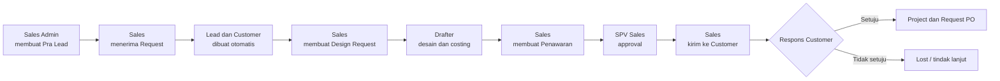

# User Guide ROBUST Sales CRM

Panduan penggunaan untuk pengelolaan proses penjualan Laboratory Furniture & Equipment, mulai dari prospek awal hingga project dan Request PO.

| Informasi | Keterangan |
|---|---|
| Aplikasi | ROBUST Sales CRM |
| Pengguna | Administrator, Sales Admin, Sales, SPV Sales, Produksi/Drafter |
| Bahasa panduan | Indonesia |
| Terakhir diperbarui | 17 Juli 2026 |

> **Catatan:** Tombol dan menu yang tampil mengikuti role akun. Jika sebuah menu tidak terlihat, kemungkinan akun Anda tidak memiliki hak akses ke modul tersebut.

## 1. Mengenal ROBUST Sales CRM

ROBUST Sales CRM membantu tim mencatat dan memantau satu alur kerja yang saling terhubung:

Data yang dimasukkan pada tahap awal dipakai kembali pada tahap berikutnya. Karena itu, hindari membuat data customer atau project yang sama berulang kali.

## 2. Mulai Cepat

### 2.1 Login

1. Buka alamat ROBUST CRM yang diberikan oleh Administrator.
2. Isi **Email** dan **Password**.
3. Centang **Ingat saya** hanya jika memakai perangkat pribadi.
4. Klik **Masuk**.
5. Sistem menampilkan Dashboard sesuai role akun.

Untuk lingkungan demo, akun berikut tersedia dengan password `password`:

| Role | Email |
|---|---|
| Administrator | `superadmin@robust.test` |
| Sales Admin | `admin@robust.test` |
| Sales | `sales@robust.test` |
| Sales kedua | `sales2@robust.test` |
| SPV Sales | `spv@robust.test` |
| Produksi/Drafter | `drafter@robust.test` |

> Segera ganti password akun demo jika aplikasi dipakai di lingkungan produksi.

### 2.2 Kenali tampilan utama

- **Sidebar kiri** berisi menu sesuai role.
- **Dashboard** menampilkan ringkasan pekerjaan, target, dan data yang perlu ditindaklanjuti.
- **Kotak pencarian atas** digunakan untuk mencari customer, PIC, project, dan aktivitas.
- **Ikon lonceng** menampilkan pemberitahuan penting.
- **Nama pengguna** di kanan atas membuka menu Profil dan Logout.
- **Filter** pada halaman daftar membantu menyaring data berdasarkan status, tanggal, PIC, atau kata kunci.
- **Badge status** menunjukkan posisi terakhir suatu data dalam alur kerja.

### 2.3 Logout

Klik nama pengguna di kanan atas, lalu pilih **Logout**. Pada akun Sales dan Drafter, tombol Logout juga tersedia di bagian bawah sidebar.

## 3. Role dan Tanggung Jawab

| Role | Tanggung jawab utama |
|---|---|
| Administrator | Mengelola konfigurasi, user, pra lead, assignment, monitoring, dan dapat menangani approval penawaran. |
| Sales Admin | Mencatat pra lead, memilih Sales, memantau beban kerja, mengelola customer, user non-Administrator, dan Request PO. |
| Sales | Menerima request, mengelola lead/customer/aktivitas, membuat Design Request dan penawaran, mencatat respons customer, serta membuat project. |
| SPV Sales | Memeriksa penawaran dan memilih Approve, Minta Revisi, atau Tolak. |
| Produksi/Drafter | Mengerjakan Design Request, mengisi spesifikasi, costing, item hasil, dokumen, dan mengirim hasil final ke Sales. |

### Aturan akses penting

- Sales hanya dapat mengakses data penjualan yang menjadi tanggung jawabnya.
- Drafter hanya dapat mengerjakan Design Request yang ditugaskan kepadanya.
- SPV Sales dapat membaca customer dan memproses antrean approval penawaran.
- Sales Admin tidak dapat membuat, mengubah, atau menghapus akun Administrator.
- Hanya Administrator yang dapat membuka **System Settings**.

## 4. Tutorial Alur Utama dari Awal sampai Selesai

Bagian ini adalah jalur yang paling disarankan untuk penggunaan sehari-hari.

### Tahap 1 — Sales Admin membuat dan mengirim Pra Lead

1. Login sebagai **Sales Admin** atau **Administrator**.
2. Buka menu **Pra Leads**.
3. Klik **Tambah Pra Lead**.
4. Isi sekurang-kurangnya:
   - Instansi/customer.
   - Nama PIC.
   - Sumber prospek, misalnya Website, WhatsApp, Referensi, Telepon, atau Email.
   - Kebutuhan awal.
   - Prioritas.
5. Lengkapi data pendukung jika tersedia: jabatan PIC, telepon, email, jenis lab, lokasi, estimasi nilai, dan catatan Admin.
6. Pada bagian assignment, pilih Sales dengan mempertimbangkan informasi workload.
7. Pilih salah satu tindakan:
   - **Simpan** untuk menyimpan data tanpa mengirimkannya ke Sales.
   - **Simpan & Kirim** untuk memasukkan data ke menu Request Masuk milik Sales yang dipilih.

**Hasil:** status menjadi **Menunggu Konfirmasi Sales** setelah data dikirim.

> Pra Lead tidak dapat dikirim sebelum Sales dipilih.

### Tahap 2 — Sales menerima atau menolak Request Masuk

1. Login sebagai **Sales**.
2. Buka menu **Request Masuk**.
3. Gunakan pencarian atau filter prioritas jika daftar cukup panjang.
4. Buka data untuk membaca instansi, PIC, kebutuhan, estimasi nilai, dan catatan Admin.
5. Pilih tindakan:
   - Klik **Terima Request** jika prospek akan ditindaklanjuti.
   - Klik **Tolak** jika request tidak dapat ditangani, lalu isi alasan penolakan.

**Jika diterima:**

- Pra Lead berubah menjadi **Diterima Sales**.
- Sistem otomatis membuat **Lead**.
- Sistem otomatis membuat atau menghubungkan **Customer**.
- Data awal seperti instansi, PIC, kebutuhan, sumber, estimasi nilai, dan prioritas ikut disalin.

**Jika ditolak:**

- Alasan penolakan wajib diisi.
- Status berubah menjadi **Ditolak Sales**.
- Sales Admin dapat memperbaiki assignment atau data, kemudian mengirimnya kembali.

### Tahap 3 — Sales melengkapi Lead dan Customer

1. Buka menu **Leads**.
2. Pilih lead yang baru diterima.
3. Periksa kembali identitas instansi, PIC, lokasi, kebutuhan, nilai estimasi, dan prioritas.
4. Klik **Edit** jika ada informasi yang perlu dilengkapi.
5. Simpan perubahan.
6. Buka menu **Customers** dan pastikan customer tidak tercatat ganda.
7. Tambahkan atau perbaiki PIC utama, telepon, email, alamat, kategori, stage, probabilitas, dan catatan.

Gunakan **Tambah Lead Baru** hanya untuk prospek yang memang tidak berasal dari alur Pra Lead.

### Tahap 4 — Sales mencatat aktivitas tindak lanjut

1. Buka menu **Activities**.
2. Klik **Tambah Activity**.
3. Pilih customer atau lead yang berkaitan.
4. Pilih jenis aktivitas: Meeting, Call, Survey Lokasi, Presentasi, Follow Up, WhatsApp, Email, atau Penawaran.
5. Isi judul, tanggal, waktu, status, dan keterangan.
6. Jika perlu, isi lokasi/link, durasi, hasil, tindakan berikutnya, dan tanggal follow-up berikutnya.
7. Klik **Simpan**.

Aktivitas akan ikut tampil pada halaman Activities dan Calendar. Setelah aktivitas dikerjakan, perbarui status serta hasilnya agar histori customer tetap lengkap.

### Tahap 5 — Sales membuat Design Request

Design Request digunakan ketika Sales membutuhkan desain, spesifikasi, BOQ, atau costing dari tim Produksi/Drafter.

1. Dari detail Lead, pilih tindakan untuk membuat Design Request, atau buka menu **Design Request**.
2. Klik **Design Request Baru**.
3. Isi **Informasi Dasar**:
   - Customer/instansi.
   - PIC.
   - Nama project.
   - Tanggal request dan deadline.
   - Prioritas.
   - Deskripsi singkat.
4. Isi **Kebutuhan Customer**:
   - Jenis laboratorium/area.
   - Ruang lingkup, misalnya Wall Bench, Island Bench, Fume Hood, Storage Cabinet, atau Sink Area.
   - Kapasitas pengguna.
   - Deskripsi kebutuhan detail.
5. Pilih **Output/Deliverables** yang diminta, misalnya Layout 2D, Rendering 3D, Shop Drawing, BOQ, atau Cost Estimation.
6. Pilih **PIC Produksi/Drafter**.
7. Tambahkan catatan penting untuk Produksi.
8. Klik **Simpan & Kirim ke Produksi**.

**Hasil:** status menjadi **Assigned** dan Design Request tampil pada akun Drafter yang dipilih.

> Deadline tidak boleh lebih awal dari tanggal request.

### Tahap 6 — Drafter mengerjakan Design Request

1. Login sebagai **Produksi/Drafter**.
2. Perhatikan badge angka pada menu **Design Request** untuk melihat request baru.
3. Buka **Design Request**, lalu pilih request yang ditugaskan.
4. Periksa kebutuhan customer, deadline, prioritas, deliverables, catatan Sales, dan lampiran.
5. Isi feedback teknis yang tersedia:
   - Dimensi item.
   - Material dan finishing.
   - Aksesori.
   - Estimasi material.
   - Biaya material, produksi, dan instalasi.
   - Catatan teknis.
6. Isi **Item Hasil untuk Penawaran**:
   - Kategori.
   - Nama item.
   - Spesifikasi.
   - Qty dan unit.
   - Harga satuan.
7. Klik **Tambah Item** bila diperlukan.
8. Untuk mengunggah drawing, render, shop drawing, atau BOQ, buka menu **Documents**, lalu hubungkan file ke Design Request terkait.
9. Pilih tindakan yang sesuai:
   - **Simpan Progress**: menyimpan pekerjaan sementara; request baru akan masuk tahap Drafting.
   - **Kirim untuk Review**: menandai pekerjaan siap diperiksa pada status Review.
   - **Submit Final ke Sales**: menyelesaikan pekerjaan, mengunci hasil sebagai data final, dan mengirimkannya ke Sales.

**Hasil Submit Final:** status menjadi **Completed**, progress 100%, dan item hasil dapat ditarik ke penawaran.

> Pastikan item hasil telah diisi sebelum Submit Final. Item kosong tidak akan dimasukkan ke penawaran.

### Tahap 7 — Sales membuat Penawaran

1. Login sebagai **Sales**.
2. Buka Design Request yang berstatus **Completed**.
3. Pilih tindakan untuk membuat penawaran, atau buka **Penawaran** lalu klik **Buat Penawaran**.
4. Jika tersedia, pilih Design Request yang selesai agar item dan data customer terisi otomatis.

Form penawaran terdiri dari empat langkah:

#### Langkah 1 — Info Dasar

1. Hubungkan ke Customer Master.
2. Periksa nama customer, PIC, dan nama project.
3. Pilih metode pengiriman: Email, WhatsApp, atau Hardcopy.
4. Isi tanggal penawaran dan masa berlaku.
5. Pilih prioritas dan mata uang.
6. Isi target margin serta catatan untuk customer jika diperlukan.
7. Klik **Lanjut**.

#### Langkah 2 — Item & Margin

1. Periksa item hasil dari Drafter.
2. Koreksi nama, spesifikasi, qty, unit, harga satuan, dan margin.
3. Klik **Tambah Item** untuk item tambahan.
4. Pastikan minimal ada satu item dengan nama, qty, dan harga satuan.
5. Klik **Lanjut**.

> Total item dihitung dari `Qty × Harga Satuan`. Margin per item dipakai sebagai informasi kontrol untuk SPV.

#### Langkah 3 — Harga

1. Pilih tipe diskon: Persen atau Nominal.
2. Isi nilai serta alasan diskon.
3. Periksa persentase PPN.
4. Tambahkan biaya lain jika ada, misalnya pengiriman atau instalasi tambahan.
5. Isi catatan internal jika diperlukan.
6. Periksa Subtotal, Diskon, PPN, Biaya Tambahan, dan Grand Total.
7. Klik **Lanjut**.

#### Langkah 4 — Review

1. Baca kembali seluruh ringkasan.
2. Pilih:
   - **Simpan Draft** untuk melanjutkan nanti.
   - **Ajukan Approval** untuk mengirim penawaran ke SPV Sales.

**Hasil:** status menjadi **Draft** atau **Menunggu Approval SPV** sesuai tindakan yang dipilih.

### Tahap 8 — SPV memeriksa penawaran

1. Login sebagai **SPV Sales**.
2. Buka menu **Approval Penawaran**.
3. Pilih penawaran berstatus **Menunggu Approval SPV**.
4. Periksa:
   - Identitas customer dan project.
   - Seluruh item, qty, dan harga.
   - Diskon dan alasannya.
   - PPN dan biaya tambahan.
   - Target margin.
   - Catatan Sales serta histori approval.
5. Pilih salah satu keputusan:
   - **Approve**: penawaran disetujui; catatan bersifat opsional.
   - **Minta Revisi**: isi catatan revisi yang jelas dan spesifik.
   - **Tolak**: isi alasan penolakan.

**Setelah Approve:** status menjadi **Approved SPV** dan Sales dapat mengunduh PDF.

**Setelah Minta Revisi:** status menjadi **Perlu Revisi**. Sales dapat mengedit lalu mengajukannya kembali.

### Tahap 9 — Sales mengirim dan mencatat respons Customer

1. Buka menu **Penawaran**.
2. Pilih penawaran berstatus **Approved SPV**.
3. Klik **Download PDF**.
4. Kirim PDF melalui metode yang telah dipilih.
5. Klik tindakan **Tandai Dikirim ke Customer**.
6. Setelah ada jawaban, pilih:
   - **Customer Setuju** dan tambahkan catatan bila perlu.
   - **Customer Tidak Setuju** dan catat alasan atau hasil negosiasi.

PDF belum dapat diunduh sebelum penawaran disetujui SPV.

### Tahap 10 — Membuat Project

Project dibuat dari penawaran yang telah dimenangkan/customer setuju.

1. Login sebagai **Sales**.
2. Buka menu **Projects**.
3. Klik **Tambah Project**.
4. Pilih penawaran Won/Customer Setuju yang belum memiliki project.
5. Isi nama project, kategori, prioritas, status awal, tanggal mulai, dan target selesai.
6. Pilih Project Manager.
7. Tambahkan tim internal, vendor, lokasi, scope of work, metode kerja, skema pembayaran, dan catatan bila diperlukan.
8. Klik **Simpan Project**.

**Hasil:** nilai project, pajak, customer, dan total ditarik dari penawaran terkait.

### Tahap 11 — Sales Admin membuat Request PO

Disarankan membuat Request PO setelah penawaran disetujui customer dan data order telah lengkap.

1. Login sebagai **Sales Admin** atau **Administrator**.
2. Buka menu **Request PO**.
3. Klik **Request PO Baru**.
4. Pilih penawaran yang memenuhi syarat dan belum pernah dibuatkan Request PO.
5. Isi nomor PO customer dan unggah buktinya jika tersedia.
6. Lengkapi alamat pengiriman, PIC penerima, NPWP, termin pembayaran, serta estimasi tanggal pengiriman.
7. Periksa checklist kelengkapan:
   - Penawaran final sudah approved SPV.
   - PO customer/bukti order sudah dilampirkan.
   - Data customer sudah lengkap.
   - Alamat pengiriman/lokasi project sudah jelas.
   - PIC penerima sudah jelas.
   - Termin pembayaran sudah jelas.
   - Data siap diinput ke Accurate.
8. Klik **Simpan/Buat Request PO**.
9. Setelah diproses di Accurate, buka detail Request PO dan ubah status:
   - Diajukan ke Accurate.
   - Diproses di Accurate.
   - PO Accurate Dibuat.
   - Dibatalkan.
10. Isi nomor, tanggal, dan catatan PO Accurate.

File PO customer maksimal 5 MB dengan format PDF, JPG, PNG, DOC/DOCX, atau XLS/XLSX.

## 5. Panduan Fitur per Role

### 5.1 Sales Admin dan Administrator

#### Memantau Pipeline

1. Buka **Monitoring Pipeline**.
2. Periksa jumlah data pada setiap tahap, dari Pra Lead hingga Request PO.
3. Klik tahap yang dapat dibuka untuk melihat daftar detail.
4. Prioritaskan status yang menunggu tindakan, seperti Menunggu Konfirmasi Sales, Menunggu Approval, atau Perlu Revisi.

#### Mengalihkan Lead ke Sales lain

1. Buka **Assignment**.
2. Bandingkan workload dan acceptance rate setiap Sales.
3. Pilih lead yang akan dialihkan.
4. Pilih Sales tujuan.
5. Konfirmasi reassignment.

Gunakan **Export Excel** jika data assignment perlu dianalisis atau dilaporkan di luar sistem.

#### Mengelola user

1. Buka **Manage User**.
2. Klik **Tambah User**.
3. Isi nama, email, jabatan, telepon, role, password, dan status.
4. Klik **Simpan**.
5. Gunakan ikon Edit untuk mengubah data atau reset password.
6. Gunakan tombol status untuk mengaktifkan/menonaktifkan akun.
7. Gunakan Hapus hanya untuk akun yang sudah tidak digunakan.

Administrator tidak dapat menonaktifkan atau menghapus akunnya sendiri. Sistem juga menjaga agar minimal satu akun Administrator tetap tersedia.

#### Mengubah branding — khusus Administrator

1. Buka **System Settings**.
2. Isi nama perusahaan, tagline, dan target penjualan bulanan.
3. Unggah logo maksimal 2 MB dan favicon maksimal 1 MB.
4. Klik **Simpan Branding**.

Bagian **Maintenance Command** hanya dijalankan oleh pengguna teknis yang memahami dampaknya.

### 5.2 Sales

#### Mengelola Customer

1. Buka **Customers**.
2. Gunakan pencarian atau filter status/kategori.
3. Klik customer untuk melihat PIC, pipeline, aktivitas, penawaran, project, dan dokumen.
4. Klik **Edit Customer** untuk memperbarui data.
5. Atur stage dan probability sesuai kondisi terkini.

Tahapan customer yang tersedia: Identify, Approaching, Follow Up, Won/Closing, Lost, dan Maintaining.

#### Mengelola Lead manual

1. Buka **Leads**.
2. Klik **Tambah Lead Baru**.
3. Isi identitas customer/PIC, kebutuhan, sumber, nilai estimasi, prioritas, dan status.
4. Unggah dokumen pendukung bila tersedia.
5. Simpan.

Gunakan cara ini hanya jika Lead tidak berasal dari Request Masuk.

#### Menangani revisi penawaran

1. Buka penawaran berstatus **Perlu Revisi** atau **Ditolak SPV**.
2. Baca catatan SPV dan histori approval.
3. Klik **Edit**.
4. Perbaiki item, harga, diskon, pajak, atau catatan sesuai arahan.
5. Pada langkah Review, pilih **Ajukan Approval**.

Penawaran hanya dapat diedit saat berstatus Draft, Perlu Revisi, atau Ditolak SPV.

### 5.3 SPV Sales

- Mulai pekerjaan dari kartu antrean pada Dashboard atau menu **Approval Penawaran**.
- Gunakan filter status untuk memisahkan penawaran yang menunggu, sudah disetujui, perlu revisi, dan ditolak.
- Tulis catatan revisi yang dapat ditindaklanjuti, misalnya item, nilai, dan perubahan yang diharapkan.
- Periksa kembali histori ketika penawaran diajukan ulang.
- Hindari Approve jika diskon, margin, pajak, atau identitas customer belum jelas.

### 5.4 Produksi/Drafter

- Gunakan **Design Request** sebagai daftar pekerjaan utama.
- Gunakan **Tasks** untuk melihat tugas berdasarkan deadline dan status.
- Gunakan **Projects** untuk memantau project produksi.
- Gunakan **Documents** untuk drawing, BOQ, laporan, atau dokumen lain.
- Gunakan **Calendar** untuk melihat deadline.
- Gunakan **Reports** untuk memantau progress dan performa pekerjaan.

Urutan kerja yang disarankan: baca kebutuhan → cek deadline → simpan progress → unggah dokumen → periksa costing dan item → submit final.

## 6. Fitur Bersama

### 6.1 Pencarian global

1. Klik kotak pencarian di bagian atas.
2. Ketik nama customer, PIC, project, atau aktivitas.
3. Tekan Enter.
4. Pilih hasil yang sesuai.

Jika hasil tidak ditemukan, coba gunakan sebagian nama atau periksa filter pada halaman asal.

### 6.2 Documents

1. Buka menu **Documents**.
2. Klik tombol unggah/tambah dokumen.
3. Pilih data yang akan dihubungkan: Customer, Lead, Design Request, atau Project.
4. Isi nama, kategori, dan deskripsi.
5. Pilih file, lalu simpan.

Ukuran maksimum dokumen umum adalah 10 MB. Dokumen yang dihapus akan diarsipkan secara soft delete, bukan langsung dihapus permanen dari database.

### 6.3 Calendar

Calendar menyatukan jadwal aktivitas, deadline Design Request, dan target project yang dapat diakses oleh akun. Gunakan Calendar setiap awal hari untuk memeriksa jadwal dan pekerjaan yang mendekati deadline.

### 6.4 Reports

Gunakan **Reports** untuk memantau performa penjualan atau produksi. Pada laporan Sales/Admin, klik **Export CSV** bila laporan perlu diolah lebih lanjut.

### 6.5 Profil dan password

1. Klik nama pengguna, lalu pilih **Profil**, atau buka menu **Settings**.
2. Ubah nama, email, telepon, atau jabatan, lalu simpan.
3. Untuk mengganti password, isi password saat ini.
4. Isi password baru minimal 8 karakter dan ulangi konfirmasi.
5. Simpan perubahan.

## 7. Arti Status Penting

### Pra Lead

| Status | Arti | Tindakan berikutnya |
|---|---|---|
| Draft | Data belum ditugaskan/dikirim | Lengkapi data dan pilih Sales |
| Ditugaskan | Sales telah dipilih tetapi belum dikirim | Kirim ke Sales |
| Menunggu Konfirmasi Sales | Muncul pada Request Masuk | Sales menerima atau menolak |
| Diterima Sales | Sudah menjadi Lead | Sales melakukan follow-up |
| Ditolak Sales | Sales menolak request | Admin mengevaluasi alasan dan assignment |

### Design Request

| Status | Arti | Tindakan berikutnya |
|---|---|---|
| Draft | Request belum aktif | Lengkapi dan tugaskan |
| Assigned | Sudah masuk ke Drafter | Drafter mulai mengerjakan |
| Drafting | Pekerjaan berlangsung | Lengkapi desain dan spesifikasi |
| Costing | Perhitungan biaya berlangsung | Selesaikan costing |
| Review | Siap diperiksa | Periksa hasil sebelum final |
| Completed | Hasil final telah dikirim | Sales membuat penawaran |
| Rejected | Request/hasil ditolak | Periksa catatan dan revisi |

### Penawaran

| Status | Arti | Tindakan berikutnya |
|---|---|---|
| Draft | Belum diajukan | Sales melengkapi dan mengajukan |
| Menunggu Approval SPV | Dalam antrean SPV | SPV melakukan review |
| Perlu Revisi | SPV meminta perbaikan | Sales mengedit dan mengajukan ulang |
| Approved SPV | Disetujui | Sales download PDF dan mengirim |
| Ditolak SPV | Tidak disetujui | Sales membaca alasan dan memperbaiki bila relevan |
| Dikirim ke Customer | Penawaran sudah dikirim | Catat respons customer |
| Customer Setuju | Deal berhasil | Buat Project dan Request PO |
| Customer Tidak Setuju | Deal tidak berhasil | Catat alasan dan tindak lanjut |
| Request PO Dibuat | Proses diteruskan ke PO | Pantau proses Accurate |

### Project

| Status | Arti |
|---|---|
| Planning | Project dalam persiapan |
| Berjalan | Pekerjaan sedang berlangsung |
| Finishing | Memasuki tahap penyelesaian |
| Selesai | Project telah selesai |
| Dibatalkan | Project tidak dilanjutkan |

## 8. Checklist Operasional Harian

### Sales Admin

- Periksa Pra Lead baru.
- Pastikan setiap Pra Lead memiliki Sales yang sesuai.
- Pantau request yang belum direspons.
- Periksa workload dan acceptance rate.
- Tindak lanjuti Request PO dan proses Accurate.

### Sales

- Periksa Request Masuk dan notifikasi.
- Periksa aktivitas serta follow-up hari ini.
- Perbarui Lead dan Customer setelah komunikasi.
- Pantau Design Request yang mendekati deadline.
- Tindak lanjuti penawaran yang perlu revisi atau respons customer.

### SPV Sales

- Periksa antrean approval.
- Dahulukan penawaran prioritas tinggi atau mendekati masa berlaku.
- Pastikan catatan revisi jelas.

### Drafter

- Periksa request baru dan deadline.
- Simpan progress secara berkala.
- Pastikan drawing, costing, dan item hasil lengkap sebelum Submit Final.

## 9. Masalah Umum dan Solusinya

| Masalah | Penyebab yang mungkin | Solusi |
|---|---|---|
| Tidak bisa login | Email/password salah atau akun nonaktif | Periksa kembali data login; hubungi Admin untuk aktivasi/reset password |
| Menu tidak terlihat | Role tidak memiliki akses | Pastikan login dengan role yang sesuai |
| Muncul halaman 403 | Data bukan milik pengguna atau hak akses tidak sesuai | Kembali ke daftar dan hubungi Admin jika assignment keliru |
| Pra Lead tidak muncul di Request Masuk | Belum dikirim, Sales berbeda, atau status bukan Menunggu Konfirmasi | Periksa assignment dan klik Simpan & Kirim |
| Tidak bisa menolak Request | Alasan belum diisi | Isi alasan penolakan maksimal 500 karakter |
| Drafter tidak menerima Design Request | PIC Produksi salah/nonaktif atau request belum dikirim | Periksa assignment dan status Assigned |
| Item Drafter tidak masuk ke Penawaran | Design Request belum Completed atau item kosong saat Submit Final | Lengkapi item dan lakukan Submit Final |
| Penawaran tidak bisa diedit | Status bukan Draft/Revisi/Ditolak SPV | Selesaikan proses sesuai status atau minta arahan SPV |
| PDF tidak bisa diunduh | Penawaran belum Approved SPV | Ajukan dan tunggu approval SPV |
| Tidak bisa membuat Project | Penawaran belum Won/Customer Setuju atau sudah memiliki project | Periksa status dan relasi project |
| Tidak bisa membuat Request PO | Penawaran belum memenuhi syarat atau Request PO sudah ada | Periksa status dan daftar Request PO |
| Dokumen tidak dapat dibuka | Storage link belum tersedia atau file tidak ada | Hubungi Administrator teknis untuk memeriksa storage |
| Data tidak ditemukan | Filter masih aktif | Hapus filter atau gunakan kata kunci yang lebih pendek |

## 10. Praktik Terbaik

1. Cari customer sebelum membuat customer baru untuk mencegah duplikasi.
2. Gunakan catatan yang singkat, jelas, dan dapat ditindaklanjuti.
3. Perbarui status segera setelah pekerjaan selesai.
4. Pastikan tanggal deadline dan masa berlaku realistis.
5. Periksa kembali qty, harga, diskon, dan PPN sebelum approval.
6. Gunakan Documents agar file tidak tersebar di percakapan pribadi.
7. Jangan membagikan password atau menggunakan akun milik orang lain.
8. Logout setelah memakai komputer bersama.

## 11. Simulasi Latihan untuk Pengguna Baru

Gunakan data demo dan lakukan latihan berikut secara berurutan:

1. Sales Admin membuat satu Pra Lead dan mengirimkannya ke `sales@robust.test`.
2. Sales menerima request dan memastikan Lead serta Customer terbentuk.
3. Sales membuat satu aktivitas Follow Up.
4. Sales membuat Design Request dan menugaskannya ke `drafter@robust.test`.
5. Drafter mengisi minimal satu item, biaya, dan catatan teknis, lalu Submit Final.
6. Sales membuat penawaran dari Design Request, lalu mengajukan approval.
7. SPV memberikan catatan revisi.
8. Sales memperbaiki penawaran dan mengajukannya kembali.
9. SPV melakukan Approve.
10. Sales mengunduh PDF, menandai sudah dikirim, lalu mencatat Customer Setuju.
11. Sales membuat Project.
12. Sales Admin membuat Request PO dan mengubah status hingga PO Accurate Dibuat.

Jika seluruh langkah berhasil, pengguna sudah memahami alur inti ROBUST Sales CRM.

